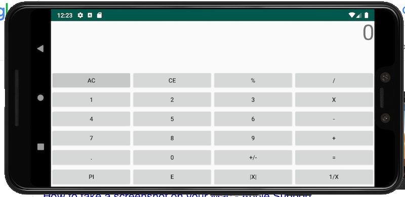
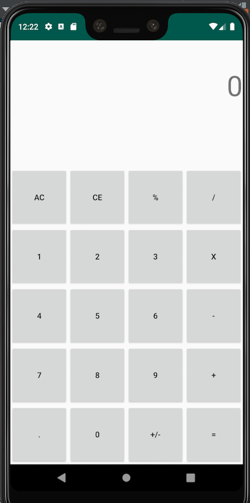

# Week1Daily3Calculator
Android Calculator App

This Android Application aims to create a functioning calculator with basic operations while in the vertical orientation, more advanced operations that are revealed when put in the horizontal orientation.

The LinearLayout is used as the root ViewGroup for the calculator to make sure that the the TextViews that display the input and results of the button presses are at the top. Two TextViews are used to show the outputs. One TextView shows the inputs of the button presses, and the other TextView shows the potential result of the inputs and operator that are currently being used by the calculator.

The GridLayout with 4 columns and 5 rows is used as the ViewGroup for the buttons. Each button is weighted by column and row to ensure that all the buttons stretch out even across most of the available screen space of the device running the calculator.

The additional buttons have their visibilities set to **GONE** while in vertical mode, but while in horizontal mode another row is added to the GridLayout and the additional buttons' visibilities are set to **VISIBLE**.

The logic behind the calculator and controlled by one switch statement to determine which buttons have been pressed and multiple if statements. Private variables are stored while the calculator is running to hold the inputs of the user.

